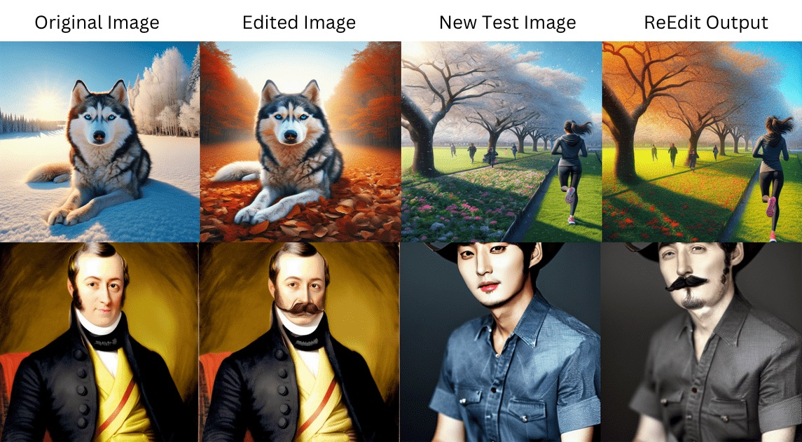

# ReEdit: Multimodal Exemplar-Based Image Editing with Diffusion Models (WACV 2025)

[](https://reedit-diffusion.github.io/)
[](https://arxiv.org/abs/2411.03982)
[](https://github.com/reedit-diffusion/reedit-diffusion)
[](https://huggingface.co/datasets/tarun-menta/re-edit-bench)



ReEdit is an efficient end-to-end optimization-free framework for exemplar-based image editing. Unlike existing approaches, it doesn't require fine-tuning or optimization during inference time.

## Overview

Given a pair of exemplar images (original and edited), ReEdit captures the edit and applies it to a test image to obtain the corresponding edited version. The framework consists of three main components:

1. **Image Space Edit Capture**: Uses pretrained adapter modules to capture edits in the image embedding space
2. **Text Space Edit Capture**: Incorporates multimodal VLMs for detailed reasoning and edit description
3. **Content Preservation**: Conditions image generation on test image features and self-attention maps

## Key Features

- No fine-tuning or optimization required during inference
- ~4x faster than baseline methods
- Preserves original image structure while applying edits
- Works with various types of edits
- Model-agnostic (independent of base diffusion model)

## Dataset

The project includes a curated dataset of 1474 exemplar pairs covering various edit types:

- Global Style Transfer (428 pairs)
- Background Change (212 pairs)
- Localized Style Transfer (290 pairs)
- Object Replacement (366 pairs)
- Motion Edit (14 pairs)
- Object Insertion (164 pairs)

## Architecture

ReEdit combines several key components:

1. **IP-Adapter**: Handles image prompt conditioning
2. **LLaVA Integration**: Provides detailed reasoning and text descriptions
3. **PNP Module**: Maintains the structure of the test image while performing the edit

## Performance

Compared to baselines:
- 4x faster inference time
- Better consistency in non-edited regions
- Higher edit accuracy
- Improved structure preservation

## Citation

```
@InProceedings{Srivastava_2025_WACV,
    author    = {Srivastava, Ashutosh and Menta, Tarun Ram and Java, Abhinav and Jadhav, Avadhoot Gorakh and Singh, Silky and Jandial, Surgan and Krishnamurthy, Balaji},
    title     = {ReEdit: Multimodal Exemplar-Based Image Editing},
    booktitle = {Proceedings of the Winter Conference on Applications of Computer Vision (WACV)},
    month     = {February},
    year      = {2025},
    pages     = {929-939}
}
```
